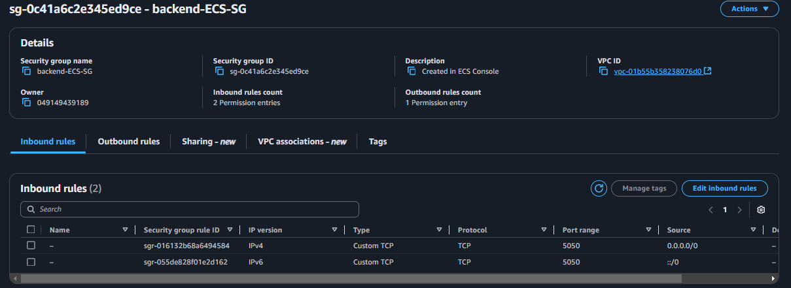
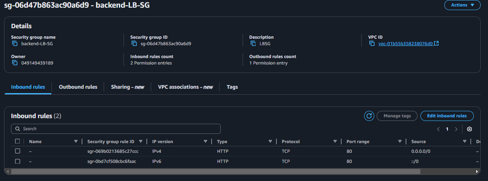
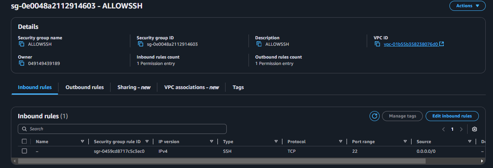
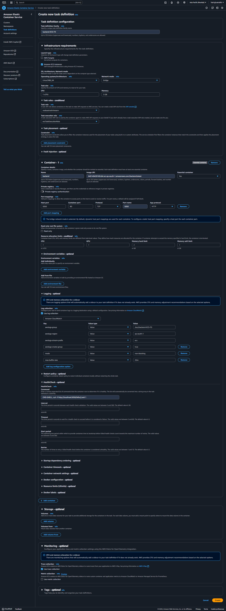
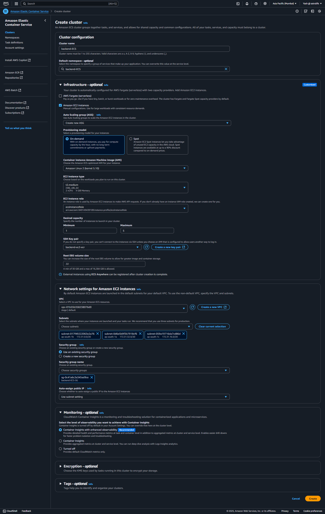
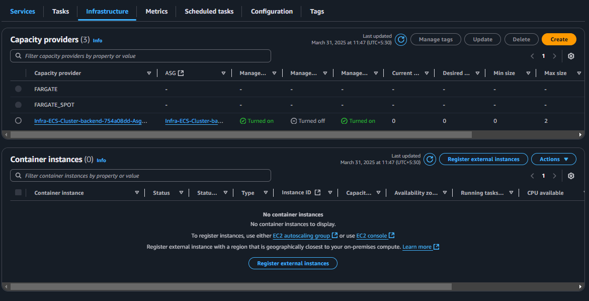
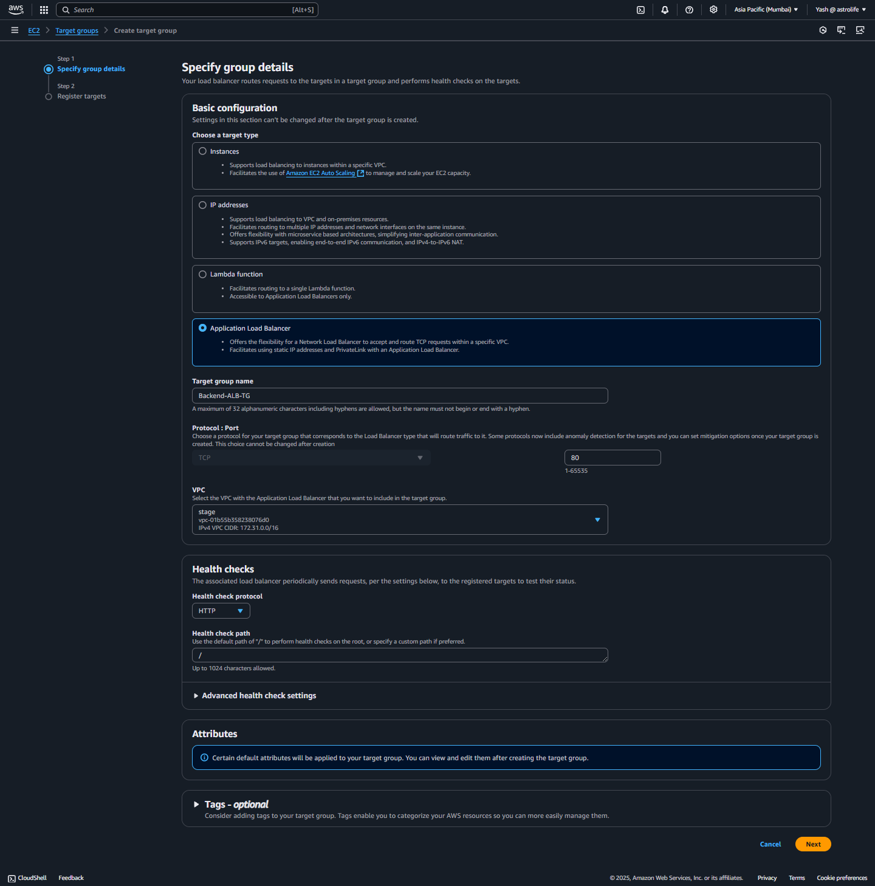
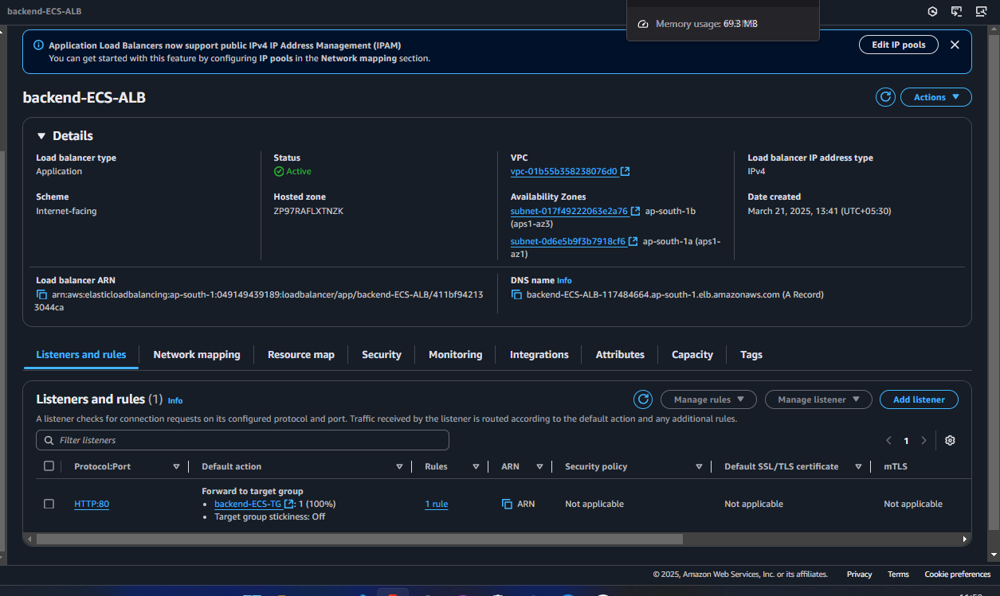
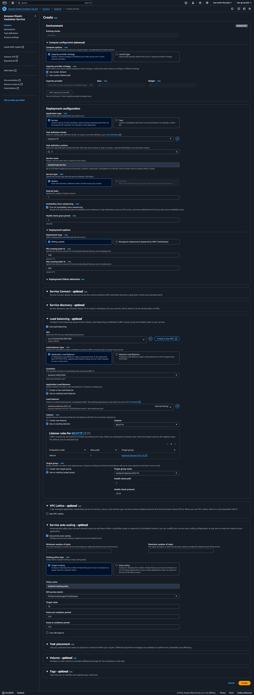

# AWS ECR and ECS Deployment Guide for Node.js Express Application

## Overview
This guide documents the process of deploying a Node.js Express application to AWS using Amazon Elastic Container Registry (ECR) and Elastic Container Service (ECS).

## Prerequisites
- AWS CLI installed and configured
- Docker installed on your local machine
- Node.js Express application ready for containerization
- AWS account with appropriate permissions

## Step 1: Deploy to Amazon ECR

### 1.1 Create an ECR Repository
```bash
# Create a new ECR repository
aws ecr create-repository --repository-name my-node-app --region ap-south-1
```

### 1.2 Authenticate Docker to ECR
```bash
# View Push commands from ECR Dashboard
aws ecr get-login-password --region ap-south-1 | docker login --username AWS --password-stdin YOUR_AWS_ACCOUNT_ID.dkr.ecr.ap-south-1.amazonaws.com
```

### 1.3 Build and Tag the Docker Image
```bash
# Build the Docker image
docker build -t my-node-app .

# Tag the image with the ECR repository URI
docker tag my-node-app:latest YOUR_AWS_ACCOUNT_ID.dkr.ecr.ap-south-1.amazonaws.com/my-node-app:latest
```

### 1.4 Push the Image to ECR
```bash
# Push the image to ECR
docker push YOUR_AWS_ACCOUNT_ID.dkr.ecr.ap-south-1.amazonaws.com/my-node-app:latest
```

## Step 2: Create Security Groups

### 2.1 Create Security Group for ECS Instances
1. Navigate to the EC2 Dashboard in the AWS Console
2. Click on "Security Groups" in the left sidebar
3. Click "Create Security Group"
4. Fill out the basic details:
   - Security group name: `backend-ECS-SG`
   - Description: `Security group for ECS instances running Node.js app`
   - VPC: Select your VPC
5. Configure Inbound Rules:
   - Add a rule to allow your application port (e.g., 3000) from anywhere:
     - Type: Custom TCP
     - Protocol: TCP
     - Port Range: 3000 (or your application port)
     - Source: 0.0.0.0/0 (Anywhere)
6. Outbound Rules:
   - Keep the default (All traffic to 0.0.0.0/0)
7. Click "Create Security Group"

### 2.2 Create Security Group for Load Balancer
1. Still in the Security Groups section, click "Create Security Group" again
2. Fill out the basic details:
   - Security group name: `backend-LB-SG`
   - Description: `Security group for Load Balancer in front of ECS instances`
   - VPC: Select your VPC
3. Configure Inbound Rules:
   - Add a rule to allow HTTP traffic:
     - Type: HTTP
     - Protocol: TCP
     - Port Range: 80
     - Source: 0.0.0.0/0 (Anywhere)
4. Outbound Rules:
   - Keep the default (All traffic to 0.0.0.0/0)
5. Click "Create Security Group"


### 2.3 Create Security Group for Load Balancer
If you want to get SSH access in ec2 create another SG with port 22 inbound 


## Step 3: Create an ECS Task Definition

### 3.1 Navigate to the ECS Console
1. Open the AWS Management Console
2. Search for "ECS" and select "Elastic Container Service"

### 3.2 Create a New Task Definition
1. In the left sidebar, click on "Task Definitions"
2. Click "Create new Task Definition"
3. Select "EC2" as the launch type compatibility (not Fargate)
4. Click "Next step"

### 3.3 Configure Task Definition
1. Task Definition Name: `node-express-app-task`
2. Task Role: Select an appropriate IAM role or create a new one
3. Network Mode: Select "Bridge"
4. Task execution role: Select the ecsTaskExecutionRole or create a new one
5. Task memory (MiB): Set appropriate memory (e.g., 512 MiB)
46. Task CPU (units): Set appropriate CPU units (e.g., 4)

### 3.4 Add Container Definition
1. Click "Add container"
2. Container name: `node-express-app`
3. Image: Enter your ECR repository URI (e.g., `YOUR_AWS_ACCOUNT_ID.dkr.ecr.ap-south-1.amazonaws.com/my-node-app:latest`)
4. Memory Limits: Set appropriate soft and hard limits
5. Port mappings:
   - Container port: 5050
   - Host port: 0 (for dynamic port mapping)
   - Protocol: tcp
6. Environment variables (optional):
   - Add any required environment variables for your application
7. Health check:
   - Command: `CMD-SHELL, curl -f http://localhost:5050/health || exit 1`
   - Interval: 30
   - Timeout: 5
   - Start period: 30
   - Retries: 3
8. Click "Add"

### 3.5 Complete Task Definition
1. Review the task definition settings
2. Scroll down and click "Create"
3. Wait for the task definition to be registered


## Step 4: Create an ECS Cluster

### 4.1 Navigate to the ECS Console
1. In the AWS Management Console, go to the ECS service
2. Click on "Clusters" in the left sidebar
3. Click "Create Cluster"

### 4.2 Configure Cluster
1. Cluster name: `node-express-cluster`
2. Provisioning Model: Select "On-Demand Instance"
3. EC2 instance type: Choose an appropriate instance type (e.g., t2.micro)
4. Number of instances:
   - Desired capacity: 2 (or your preferred number)
   - Maximum capacity: 4 (or your preferred maximum)
5. EC2 AMI ID: Leave as default (Amazon ECS-optimized AMI)
6. EBS storage: Leave as default
7. Key pair: Select an existing key pair or create a new one
8. Networking:
   - VPC: Select your VPC
   - Subnets: Select at least two subnets for high availability
   - Security group: Select the `backend-ECS-SG` security group we created earlier
9. Container instance IAM role: 
   - Create a new role or select an existing ecsInstanceRole 
   - (This role allows EC2 instances to communicate with ECS service)
10. CloudWatch Container Insights: Enable if you want enhanced monitoring

### 4.3 Create Cluster
1. Review your configuration
2. Click "Create"
3. Wait for the cluster to be created and the instances to be provisioned


### 4.4
WAIT FOR SOME  TIME and in cluster in infracture tab make sure there is a container and capacity provide registerd 


## Step 5: Create Load Balancer

### 5.1 Create Target Group
1. Navigate to the EC2 Dashboard in the AWS Console
2. Click on "Target Groups" in the left sidebar near "Load Balancing"


### 5.2 Create Application Load Balancer
1. In the EC2 Dashboard, click on "Load Balancers" in the left sidebar
2. Click "Create Load Balancer"
3. Select "Application Load Balancer" and click "Create"
4. Configure load balancer:
   - Name: `node-express-alb`
   - Scheme: Internet-facing (or internal, based on your requirements)
   - IP address type: IPv4
5. Network mapping:
   - VPC: Select your VPC
   - Mappings: Select at least two availability zones and their subnets
6. Security groups:
   - Select the `backend-LB-SG` security group we created earlier
7. Configure listeners and routing:
   - Protocol: HTTP
   - Port: 80
   - Default action: Forward to target group `node-express-tg`
8. Review configuration and click "Create load balancer"
9. Wait for the load balancer to be provisioned (can take a few minutes)


## Step 6: Create an ECS Service

### 6.1 Navigate to ECS Cluster
1. Go to the ECS Console in the AWS Management Console
2. Click on "Clusters" in the left sidebar
3. Select the `node-express-cluster` we created earlier

### 6.2 Create a Service
1. Click on the "Services" tab
2. Click "Create"
3. Configure service:
   - Launch type: EC2
   - Task Definition: Select the task definition we created earlier (`node-express-app-task`)
   - Service name: `node-express-service`
   - Service type: REPLICA
   - Number of tasks: 2 (or your desired number)
   - Minimum healthy percent: 100
   - Maximum percent: 200
4. Click "Next step"

### 6.3 Configure Network
1. enable Load balancing:
2. Select existing LB we created just now
3. Production listener port:
   - Select the existing listener (HTTP:80)
4. Target group:
   - Select the existing target group `node-express-tg` we created earlier
5. Click "Next step"

### 6.4 Set Auto Scaling
1. Service Auto Scaling:
   - Choose whether to configure auto scaling or not
   - If yes, set up scaling policies based on CPU utilization or other metrics
2. Click "Next step"

### 6.5 Review and Create
1. Review your service configuration
2. Click "Create Service"
3. Click "View Service"

### 6.6 Verify Deployment
1. Monitor the service until the "Running tasks" count matches your desired count
2. Navigate to the "Task" tab to view the status of your tasks
3. Once tasks are running, access your application via the Load Balancer DNS name
   - Find the DNS name in EC2 > Load Balancers > Select your ALB > DNS name

